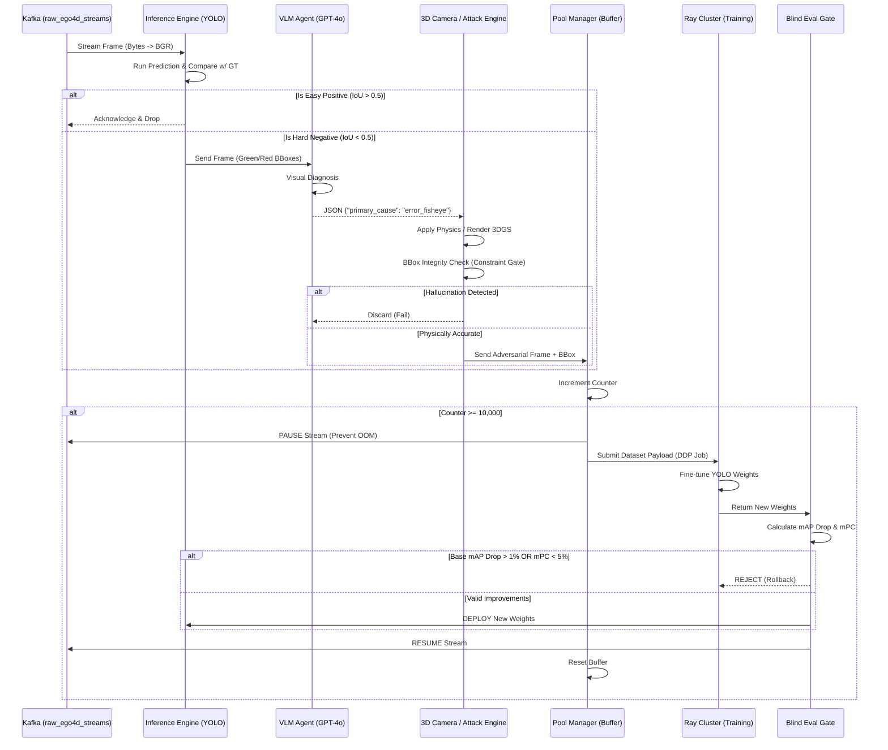

# AdverTest: System Architecture & Handover Document

**Version:** 2.0 (Continuous Training / Zero-HITL Edition)  
**Author:** Principal Staff Engineer  
**Status:** Production-Ready (Handover)

---

## 1. System Overview
AdverTest is a Model-Agnostic Egocentric Data Engine. Initially conceived as a batch-processing, Human-in-the-Loop (HITL) augmentation pipeline, the system has now completed its metamorphosis into a **Zero-HITL, Event-Driven Streaming Architecture**. 

Instead of waiting for engineers to manually curate datasets, AdverTest operates a Continuous Training (CT) loop. It ingests live video streams, autonomously detects model failures using Vision-Language Models (VLMs), procedurally generates adversarial 3D/Physics corrections, and triggers distributed fine-tuning. This creates a "Self-Evolving AI" that continuously hardens itself against the Egocentric Domain Gap (e.g., chest-mounted action cameras).

---

## 2. Component Breakdown

### 2.1. Kafka Ingestion Stream (`advertest/streaming/kafka_ingestion.py`)
- **Role:** The high-speed ingestion funnel.
- **Function:** Subscribes to the `raw_ego4d_streams` Kafka topic. It decodes byte payloads directly into RAM via OpenCV (bypassing disk I/O bottlenecks) and feeds them into the YOLOv7 Inference Engine at sub-millisecond latencies.

### 2.2. VLM Auto-Annotator (`advertest/agents/vlm_annotator.py`)
- **Role:** The Autonomous QA Engineer.
- **Function:** Replaces the manual Label Studio workflow. When the YOLO inference engine detects a "Hard Negative" (IoU < 0.5 or Conf < 0.4), this agent draws the Ground Truth (Green) and Predicted (Red) bounding boxes onto the image. It sends the Base64 image to a VLM (GPT-4o/Gemini) with a strict JSON-schema prompt. The VLM categorizes the failure (e.g., `error_fisheye`, `error_blur`) and routes it to the Attack Engine.

### 2.3. 3D Virtual Camera & Physics Attack Engine (`advertest/physics_3d/virtual_camera.py` & `advertest/attacks/engine.py`)
- **Role:** The Adversarial Data Generator.
- **Function:** Based on the VLM's diagnosis, this engine mutates the image to attack the model's weakness. 
  - For standard augmentations, it applies deep mathematical warping (True Barrel Distortion, Kinetic Blur).
  - For spatial domain gaps, it utilizes a 3D Virtual Camera mimicking a GoPro Hero 10 SuperView (Chest-Mount Extrinsics + Fisheye Intrinsics) to project 3D Gaussian Splatting (3DGS) scenes back into perfect 2D YOLO coordinates.
  - **Constraint Gate:** An `ExclusionMatrix` and `BBoxIntegrityChecker` ensure generated physics do not hallucinate or push bounding boxes out of frame.

### 2.4. Streaming Pool Manager & Dataset Compiler (`advertest/streaming/pool_manager.py`)
- **Role:** The High-Speed Buffer & Versioning Authority.
- **Function:** Accumulates the generated adversarial frames. Once a threshold is reached (e.g., 10,000 samples), it merges them with the clean baseline and generates a cryptographic `data_card.json` (SHA-256 checksum) for MLOps provenance.

### 2.5. Ray Train Trigger & Evaluation Gate (`advertest/streaming/trigger_ray_train.py` & `evaluator.py`)
- **Role:** Distributed Training & Deployment Warden.
- **Function:** Upon threshold trigger, it pauses the Kafka stream (to prevent VRAM OOM) and submits a Distributed Data Parallel (DDP) payload to a Ray Cluster. Post-training, the `RobustnessEvaluator` compares the new weights against a gold-standard holdout set. Deployment is **BLOCKED** if Base mAP drops > 1% or Corrupted mAP improves < 5%. 

---

## 3. Data Flow Diagram

The following Mermaid diagram maps the exact, zero-human journey of a single frame through the AdverTest CT pipeline.

---

## 4. Future Debt & Maintenance Strategy

As the next engineering team takes over, please monitor the following known bottlenecks and architectural debts carefully:

### 4.1. VLM API Rate Limits & Latency
- **The Risk:** GPT-4o / Gemini APIs are heavily rate-limited and introduce 1-3 seconds of latency per call. If the Inference Engine encounters a massive cluster of Hard Negatives (e.g., a completely corrupted video segment), the VLM Agent will bottleneck the Kafka stream.
- **Mitigation:** The current code processes Hard Negatives synchronously. You must implement async batching (`asyncio`) for the `vlm_annotator.py` or deploy a locally hosted VLM (e.g., LLaVA) via vLLM to remove network overhead.

### 4.2. OOM (Out-of-Memory) During 3DGS Rendering
- **The Risk:** 3D Gaussian Splatting rasterization requires heavy VRAM. If the Ray Train Trigger fails to pause the generation pipeline fast enough, the simultaneous execution of YOLO Inference, 3D Rendering, and DDP Training will cause a catastrophic CUDA OOM crash.
- **Mitigation:** The `trigger_ray_train.py` currently relies on a soft pause. Transition this to hard Kubernetes Pod affinity rules (running Training and Rendering on physically isolated GPU nodes).

### 4.3. Tracking Drift via Weights & Biases (WandB)
- **The Risk:** Continuous Training runs the risk of "Model Drift" over weeks of autonomous execution. 
- **Mitigation:** Check the `advertest/core/tracker.py` module. It currently logs all Blind Gate decisions. You must set up WandB **Alerts** to notify the Slack channel if the `Base_mAP` trends downwards over 3 consecutive deployments, indicating that the baseline Clean data representation is eroding.

---
*End of Document. Good luck on the frontlines.*
